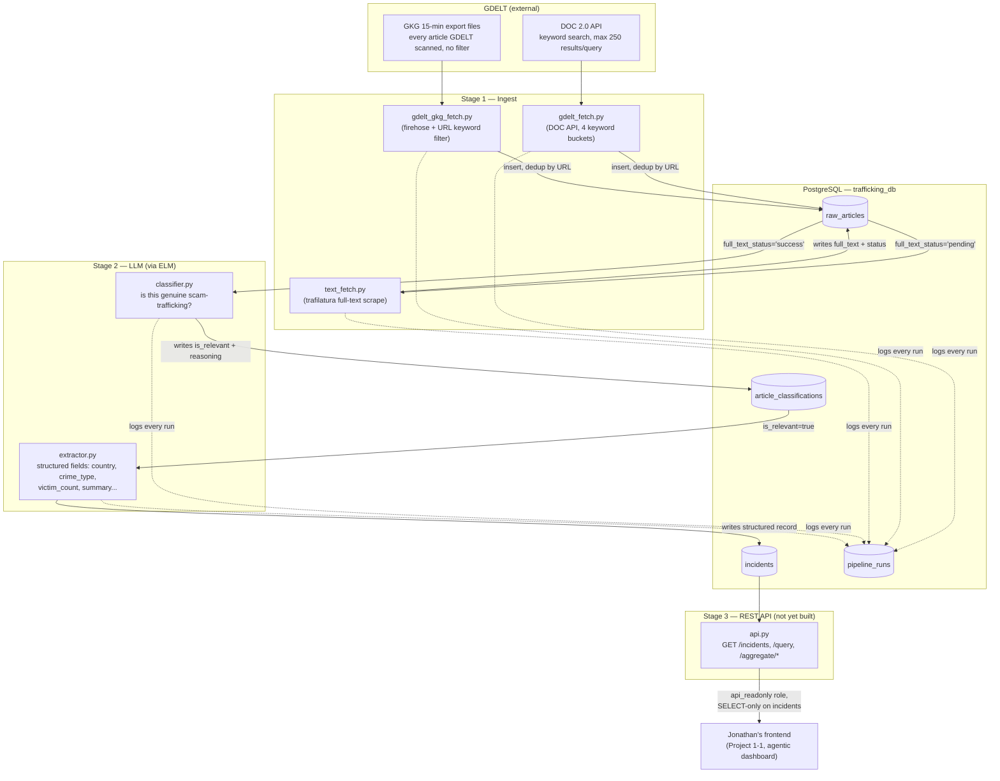
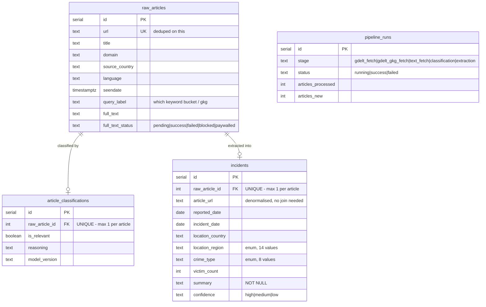
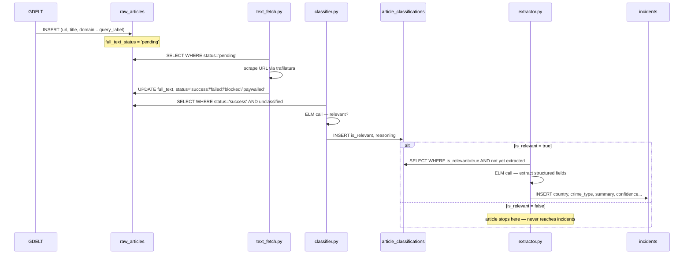
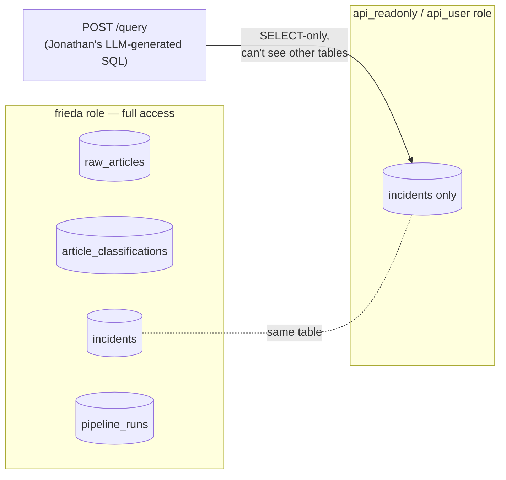

# Pipeline Architecture

Visual reference for everything in this repo. Open this file's preview in VS Code
(`Ctrl+Shift+V`) to render the diagrams — they're Mermaid, which VS Code's built-in
Markdown preview supports natively.

---

## 1. End-to-end flow

**Read it as:** two ingest paths feed the same `raw_articles` table → full text gets
scraped → an LLM filters for relevance → a second LLM call extracts structured fields
*only* for articles that passed the filter → those become `incidents` rows → the
(not-yet-built) REST API serves `incidents` to Jonathan's frontend, through a
database role that can't see or touch anything else.

---

## 2. Database schema (ERD)

**Key thing to notice:** `incidents` and `article_classifications` are **not**
directly linked — both point independently to `raw_articles.raw_article_id`. An
`incidents` row only ever exists for an article whose classification says
`is_relevant = true`. `pipeline_runs` doesn't link to anything; it's just an
audit log every stage writes to.

---

## 3. What each file does

| File | Stage | Reads from | Writes to | Notes |
|---|---|---|---|---|
| [db/schema.sql](../db/schema.sql) | — | — | defines all tables | run once to set up / update the DB |
| [db/seed_lookups.sql](../db/seed_lookups.sql) | — | — | `raw_articles`, `article_classifications`, `incidents` | fake test data for development |
| [gdelt_api/gdelt_fetch.py](../gdelt_api/gdelt_fetch.py) | 1a | GDELT DOC API | `raw_articles` | keyword search, 4 buckets, `sourcelang:english` |
| [gdelt_gkg/gdelt_gkg_fetch.py](../gdelt_gkg/gdelt_gkg_fetch.py) | 1a (alt) | GDELT GKG zip files | `raw_articles` | firehose + URL keyword filter, broader recall |
| [pipeline/text_fetch.py](../pipeline/text_fetch.py) | 1b | `raw_articles` (status=`pending`) | `raw_articles.full_text` | trafilatura scrape, per-domain rate limit |
| [pipeline/classifier.py](../pipeline/classifier.py) | 2a | `raw_articles` (status=`success`) | `article_classifications` | ELM call #1 — relevant or not |
| [pipeline/extractor.py](../pipeline/extractor.py) | 2b | `article_classifications` (relevant=true) | `incidents` | ELM call #2 — structured fields |
| `api.py` | 3 | `incidents` | — | **not built yet** — REST API for Jonathan |
| [api_contract.md](api_contract.md) | — | — | — | spec doc for the API above |
| [cron/crontab.txt](../cron/crontab.txt) | — | — | — | checked-in copy of the live cron schedule |
| `.env` / `.gitignore` | — | — | — | secrets (ELM key, DB URLs), kept out of git |

Every script in stages 1–2 follows the same shape: `start_run()` logs to
`pipeline_runs`, does its work in a batch, `finish_run()` logs the result. Every
script also has a `stats` subcommand to inspect its own table without writing SQL.

---

## 4. One article's life

Most articles die at one of two points: `text_fetch.py` can't get readable text
(paywall, 404, blocked), or `classifier.py` decides it's not actually about
scam-driven trafficking. Only the survivors become `incidents` rows.

---

## 5. Scheduling

```mermaid
gantt
    dateFormat HH:mm
    axisFormat %H:%M
    title Hourly cron (both run at :00, independently)
    section Ingest
    gdelt_fetch.py (DOC API)      :a1, 00:00, 2m
    gdelt_gkg_fetch.py (firehose) :a2, 00:00, 5m
```

Both jobs are cron'd for `0 * * * *` (every hour on the hour). `text_fetch.py`,
`classifier.py`, and `extractor.py` are **not yet cron'd** — you've been running
them manually after each ingest. Say the word if you want those automated too.

---

## 6. Security boundary

Even if Jonathan's LLM-generated SQL in `POST /query` somehow bypassed the
application-level "SELECT only" string check, the `api_user` Postgres role
physically cannot read `raw_articles`, `article_classifications`, or
`pipeline_runs`, and cannot write anywhere — it only has `SELECT` on `incidents`.
